# Procesverslag
**Auteur:** Gylianto Monadjat

**De opdrachten:** [opdracht 1](opdracht1/index.html) en [opdracht 2](opdracht2/index.html)

Markdown is een simpele manier om HTML te schrijven.  
Markdown cheat cheet: [Hulp bij het schrijven van Markdown](https://github.com/adam-p/markdown-here/wiki/Markdown-Cheatsheet).

Nb. De standaardstructuur en de spartaanse opmaak van de README.md zijn helemaal prima. Het gaat om de inhoud van je procesverslag. Besteedt de tijd voor pracht en praal aan je website.

Nb. Door *open* toe te voegen aan een *details* element kun je deze standaard open zetten. Fijn om dat steeds voor de relevante stuk(ken) te doen.

## Bronnenlijst
  1. font: https://fontsgeek.com/fonts/Old-Fashion-Script-Regular
  2. multiple animations on one element: https://stackoverflow.com/questions/33004919/chaining-multiple-css-animations
  3. webkit mask reveal effect: https://chat.openai.com

## Opdracht 1 plan

  
uitwerken na schetsen idee (voor week 2)

  ### Je storyboard:
  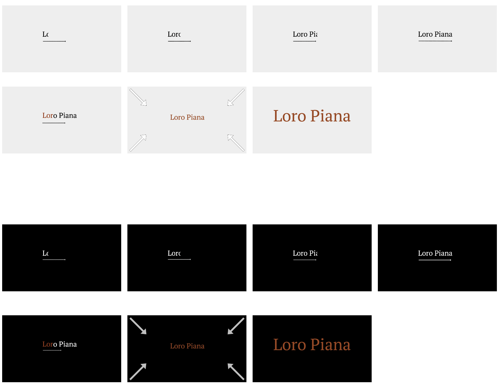

  ### Je ambitie: 
  Aan deze technieken/punten wil ik werken:
  - Ik wil werken aan mijn css animation skills omdat ik hier niet veel van weet
  - Ik wil gebruik maken voor global variables in mijn website omdat ik dat ook niet vaak doe
 

## Opdracht 1 reflectie

  
uitwerken bij afronden opdracht (voor week 4)

  ### Je uitkomst - karakteristiek screenshot(s):

  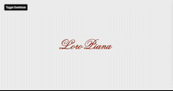

  ### Dit ging goed/Heb ik geleerd: 
  Korte omschrijving met plaatje(s)

  Het veranderen van zwarte naar bruine text:
   
  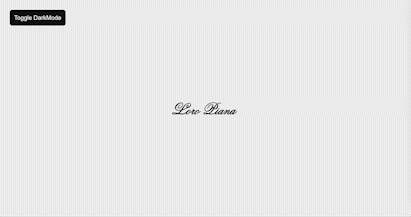
   
  code:
   
  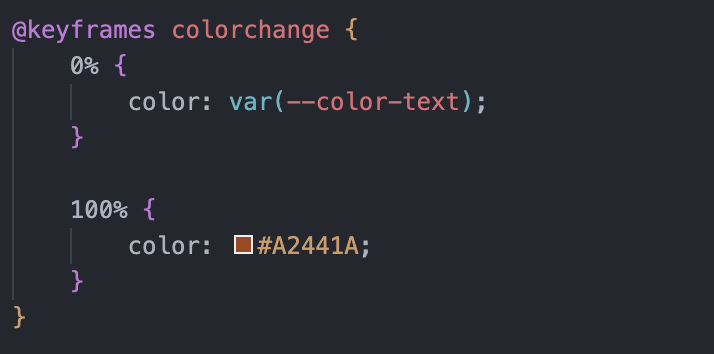

  Het groter maken van de tekst:
   
  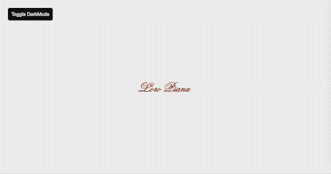
   
  code:
   
  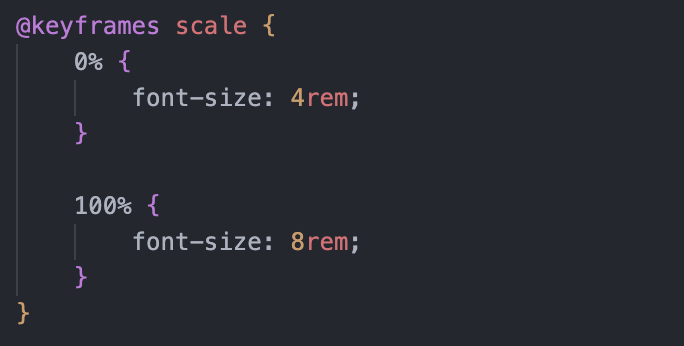

  Darkmode/Lightmode:
   
  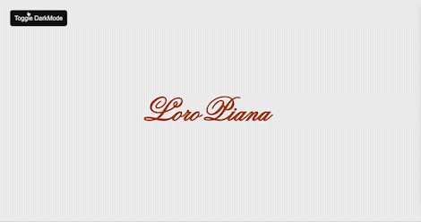
   
  code:
   
  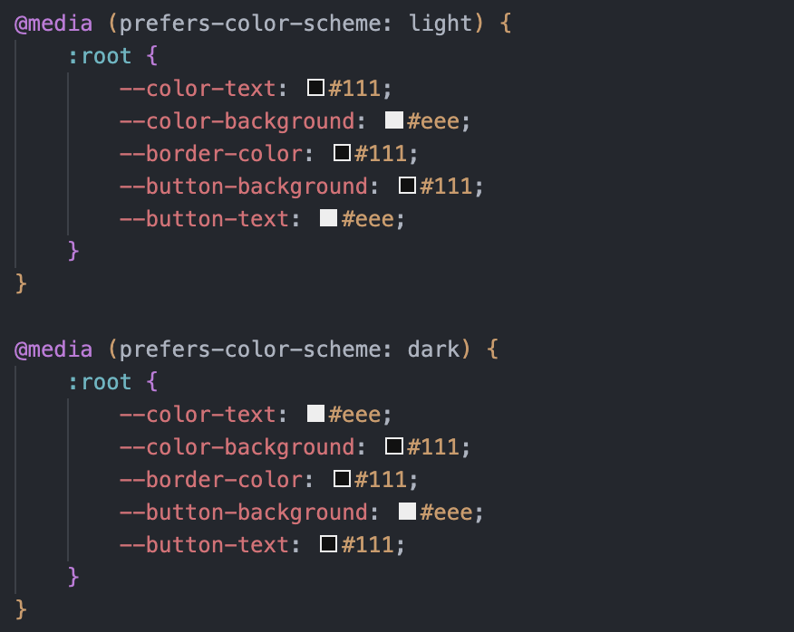
   
  De bovenstaande code is voor dark/lightmode detectie op basis van het systeem wat gebruikt wordt.
  Dit heb ik zelf uitgezet omdat ik de dark/lightmode liever trigger d.m.v. een button.
   
   
  code:
   
  Hieronder maak ik een css class aan met properties die ik door middel van javascript kan triggeren:
   
  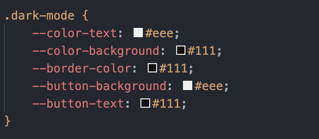
   
  Hieronder is de js function waar ik body properties verander door element classlist functie toe te voegen:
   
  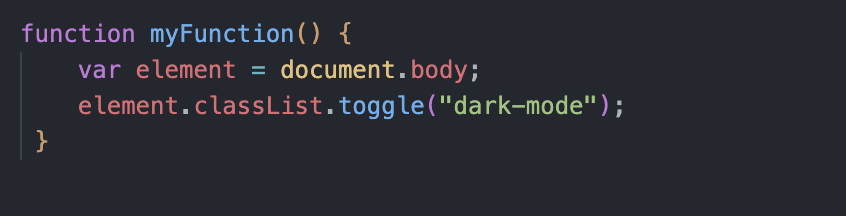

  ### Dit was lastig/Is niet gelukt:
  Korte omschrijving met plaatje(s)

  Het reveal effect ging wel maar het kon iets smoother misschien:
   
  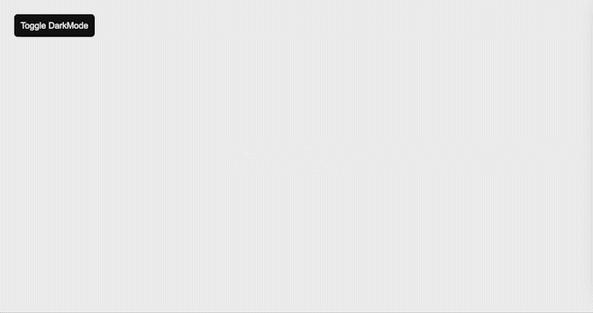
   
  code:
   
  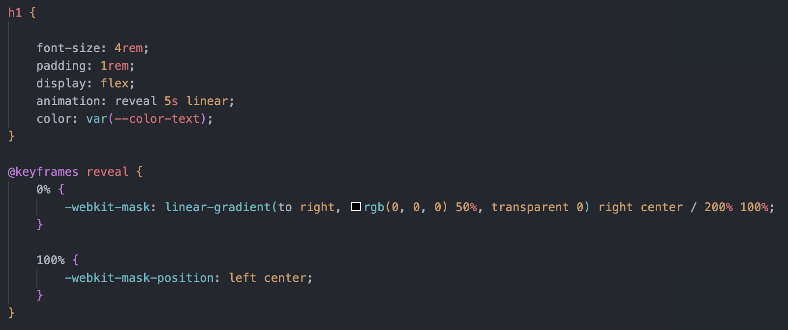

## Opdracht 2 plan

  
uitwerken na schetsen idee (voor week 5)

  ### Je ontwerp:
  

  ### Je ambitie: 
  Aan deze technieken/punten wil ik werken:
  - punt 1
  - punt 2
  - nog een punt
  - ...

## Opdracht 2 test

  
uitwerken na testen (week 7)

  Neem minimaal 5 bevindingen op:

  ### Bevinding 1:
  Omschrijving van wat er nog niet orde was (tekst en afbeeding(en)).

  #### oplossing:
  Beschrijving hoe je het hebt hebt opgelost of als het niet gelukt is hoe je het zou oplossen (tekst en afbeeding(en)).

  ### Bevinding 2:
  Omschrijving van wat er nog niet orde was (tekst en afbeeding(en)).

  #### oplossing:
  Beschrijving hoe je het hebt hebt opgelost of als het niet gelukt is hoe je het zou oplossen (tekst en afbeeding(en)).

  ### Bevinding 3:
  ...

## Opdracht 2 reflectie

  
uitwerken bij afronden opdracht (voor week 8)

  ### Je uitkomst - karakteristiek screenshot(s):
  

  ### Dit ging goed/Heb ik geleerd: 
  Korte omschrijving met plaatje(s)

  

  ### Dit was lastig/Is niet gelukt:
  Korte omschrijving met plaatje(s)

  

